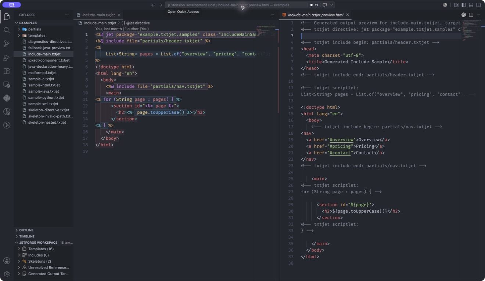

# JetForge — TxtJet & Eclipse JET

[](https://github.com/Elsyvien/JetForge/actions/workflows/ci.yml)
[](https://marketplace.visualstudio.com/items?itemName=elsyvien.txtjet-syntax)
[](LICENSE)


JetForge is a local-first VS Code extension for understanding, navigating, validating, refactoring, previewing, and generating TxtJet and Eclipse JET templates.

[Install JetForge from the Visual Studio Marketplace](https://marketplace.visualstudio.com/items?itemName=elsyvien.txtjet-syntax)

## 60-Second Quickstart

1. Install JetForge from the Marketplace and open a TxtJet template.
2. Run **JetForge: Open Getting Started** for the optional in-editor walkthrough.
3. Run **TxtJet: Select Generated Output Mode**, or let filename/content detection choose Java, HTML, XML, C, Python, or LaTeX.
4. Run **TxtJet: Open Preview Beside Source** to reach the core source-to-output workflow.
5. Open **JetForge Workspace** in Explorer to navigate includes, skeletons, unresolved references, impact graphs, and generated targets.

Java completion, hover, and definition forwarding requires compatible installed Java tooling. The [Extension Pack for Java](https://marketplace.visualstudio.com/items?itemName=vscjava.vscode-java-pack) is a practical starting point. JetForge shows local fallbacks when Java tooling cannot answer its generated virtual document.



## Features

- Default `txtjet` language mode for `.txtjet` files.
- Also recognizes `.jet`, `.javajet`, `.htmljet`, `.xmljet`, `.cjet`, `.pythonjet`, `.texjet`, `.latexjet`, `.propertiesjet`, and `.jetinc` files.
- Manual target modes for `txtjet-java`, `txtjet-html`, `txtjet-xml`, `txtjet-c`, `txtjet-python`, and `txtjet-latex`.
- TextMate highlighting for JET/JSP-style blocks:
  - `<% ... %>`
  - `<%= ... %>`
  - `<%! ... %>`
  - `<%@ ... %>`
- Java highlighting inside embedded template blocks.
- Subtle visual differentiation for template markers, directives, embedded Java, and generated-output regions.
- Basic brackets, pairs, comments, snippets, diagnostics, and completions.
- Read-only generated output and generated Java template previews.
- Per-line generated preview provenance markers for root templates, expanded includes, expressions, skeleton content, and unmapped output, with hover details and Go to Definition.
- Optional synchronized reveal between visible templates and generated previews where source maps are deterministic.
- On-demand generated-output writing and previous-generation diffing.
- Optional IP-XACT preview, generation, diff, validation, snippets, workspace indexing, and local-XSD schema intelligence behind `txtjet.ipxact.enabled`.
- Outline symbols for directives, template Java blocks, expressions, declarations, and generated-output regions.
- Go to Definition and Peek Definition for `@include file="..."`, `@jet skeleton="..."`, and local template Java helper methods.
- Workspace-wide template, include, skeleton, unresolved-reference, and generated-target indexing in the `JetForge Workspace` Explorer view.
- Impact graph reports for templates, includes, and skeletons so project-level generated-output blast radius is visible before edits.
- Safe refactor commands to extract selected template text into `.jetinc` files and rename or move includes/skeletons while updating references.
- Find All References, Rename Symbol, and Signature Help for local template Java helper methods declared in `<%! ... %>` blocks.
- Auto Detect support that can switch a newly opened `.txtjet` file to the likely target mode.
- Remembered per-file language choices with commands to clear them.
- No runtime network access, telemetry, or proprietary template content.

## Develop Or Install Locally

Package the extension:

```bash
npm run package
```

Run the full local release check:

```bash
npm run verify:release
```

This checks release metadata, runs the unit/package gate and a real VS Code Extension Host smoke test, packages the VSIX, then installs that exact artifact into a clean VS Code profile for an installed-extension smoke test. Set `VSCODE_TEST_VERSION=1.85.2` to run both smoke paths against the declared minimum VS Code release.

Install the generated package:

```bash
code --install-extension txtjet-syntax-0.0.21.vsix
```

Reload VSCode after installation if the language mode is not immediately available.

CI packages and installs the exact VSIX in clean Linux and Windows profiles against the minimum and current stable VS Code releases. Matching `vX.Y.Z` tags on `main` can publish that verified artifact through the protected `marketplace` environment and attach it with a checksum to a GitHub Release.

For help, see [SUPPORT.md](SUPPORT.md). Contributions should follow [CONTRIBUTING.md](CONTRIBUTING.md), and vulnerabilities should be reported privately as described in [SECURITY.md](SECURITY.md).

## Usage

Open a `.txtjet` file. VSCode should select the `txtjet` language mode automatically.

If the generated outer content should be highlighted as a specific language, use the language mode selector and choose one of:

- `TxtJet Java Output`
- `TxtJet HTML Output`
- `TxtJet XML Output`
- `TxtJet C Output`
- `TxtJet Python Output`
- `TxtJet LaTeX Output`

These modes describe the generated output language outside template blocks. Embedded Java inside `<% ... %>`, `<%= ... %>`, `<%! ... %>`, and `<%@ ... %>` is highlighted in every TxtJet mode.
Template delimiters are also injected into common outer-language strings, comments, and preprocessor regions so generated C/XML/HTML/Python/Java/LaTeX text does not hide TxtJet blocks.
By default, TxtJet also applies subtle editor decorations that distinguish generated-output text from template markers, directives, and embedded Java. Run `TxtJet: Toggle Region Background Coloring` or disable `txtjet.visualDifferentiation.enabled` if a theme already provides enough contrast.

Auto Detect can infer the generated target language from filename hints and file content when a default `.txtjet` file is opened. It only switches files that are still in the default `TxtJet` mode, and it does not override a manual `TxtJet ...` language mode selection.

If the VSCode language selector is inconvenient, use the TxtJet commands:

- `TxtJet: Select Generated Output Mode`
- `TxtJet: Auto Detect Generated Output Mode`
- `TxtJet: Use Generated C Output Mode`
- `TxtJet: Use Generated Python Output Mode`
- `TxtJet: Use Generated LaTeX Output Mode`
- `TxtJet: Use Generated XML Output Mode`
- `TxtJet: Use Generated HTML Output Mode`
- `TxtJet: Use Generated Java Output Mode`
- `TxtJet: Use Generic Template Mode`
- `TxtJet: Clear Remembered Target Language`
- `TxtJet: Clear All Remembered Target Languages`
- `TxtJet: Toggle Region Background Coloring`
- `TxtJet: Toggle Generated Preview Provenance Lens`
- `TxtJet: Show Source for This Output Line`
- `TxtJet: Show All Contributions for This Output Line`

TxtJet files also show a clickable status bar item for selecting the target language.

Manual selections are remembered for the file in the current workspace. Auto-detected choices are not remembered, so detection can be rerun after file content changes. The selector and status bar indicate whether the current mode is remembered or auto/default. Auto Detect checks filename hints before scanning content, so names like `packet.c.txtjet`, `model.py.txtjet`, `schema.xml.txtjet`, and `report.tex.txtjet` open in the expected target mode.

## JetForge Workspace Intelligence

The `JetForge Workspace` Explorer view indexes workspace templates, include fragments, skeleton files, unresolved references, generated output targets, and opt-in IP-XACT templates. It understands `.txtjet`, `.jet`, `.javajet`, `.htmljet`, `.xmljet`, `.cjet`, `.pythonjet`, `.texjet`, `.latexjet`, `.propertiesjet`, `.jetinc`, and `.skeleton` files. Empty groups stay out of the way, unresolved entries open their exact source range, and generated-target entries open the corresponding generated-output preview.

Use these commands for project-level workflows:

- `TxtJet: Refresh Workspace Model`
- `TxtJet: Open Including Template`
- `TxtJet: Open Generated Java For Template`
- `TxtJet: Validate Workspace Templates`
- `JetForge: Set Up and Test Compiler Toolchain`
- `TxtJet: Open IP-XACT Template`
- `TxtJet: Show Impact Graph`
- `TxtJet: Extract Selection to Include`
- `TxtJet: Rename or Move Include/Skeleton`

Workspace indexing reuses the resource-scoped `txtjet.resolution.includePaths` and `txtjet.resolution.skeletonPaths`, so each folder in a multi-root workspace can resolve its own project layout and unresolved diagnostics update when referenced files are created, deleted, or changed. Compiler, generation, and IP-XACT settings follow the same per-resource configuration model. The generated Java preview URI is stable per source template and remains the bridge to installed Java tooling, while the local workspace class index supplies deterministic cross-template IntelliSense even when that tooling ignores virtual documents.

Impact graph reports open in the rendered Markdown preview and show direct and transitive Mermaid edges from a changed include, skeleton, or template to affected templates and generated-output targets. The refactor commands rebuild the workspace model from current open buffers before editing and fail closed if any resolved reference cannot be mapped. Extraction creates a new workspace-local `.jetinc`; include/skeleton rename or move uses a confirmed WorkspaceEdit that updates only resolved references in the current workspace model.

You can rerun detection manually with the command:

```txt
TxtJet: Auto Detect Generated Output Mode
```

## Snippets

Snippets are available in all TxtJet modes:

- `scriptlet`
- `expr`
- `decl`
- `jet`
- `include`
- `if`
- `for`
- `ipxact`
- `ipxact-component`
- `ipxact-busInterface`
- `ipxact-memoryMap`
- `ipxact-addressBlock`
- `ipxact-register`
- `ipxact-field`

## Diagnostics And Completions

The extension reports lightweight TxtJet syntax diagnostics:

- unclosed `<% ... %>` blocks
- unexpected `%>` delimiters
- malformed or empty directives
- unterminated quoted strings inside directives

Completions are available for template markers after typing `<`, plus directive names, common directive attributes, configured project metadata attributes, and directive values inside `<%@ ... %>` blocks. Directive value completions suggest local include files, skeleton files, common Java imports, reasonable `@jet` package/class values, and `ipxact` metadata values without scanning broadly outside the template directory and configured resolution paths. Inside scriptlet, expression, and declaration blocks, JetForge forwards completion, hover, and Go to Definition requests through the generated Java preview to installed Java tooling, with local fallback completions when external Java tooling does not answer virtual preview documents. Local helper methods declared in `<%! ... %>` blocks also support Find All References, conservative Rename Symbol, and Signature Help for direct helper calls and `this.helper(...)` calls. Generated-output regions get local fallback suggestions for Java, Python, and C/C++ when the selected or detected output mode matches. Matched IP-XACT generated-output regions also offer local XML node snippets for common IP-XACT elements. When `txtjet.ipxact.schemaPaths` points to local XSD files or directories, completions narrow to schema-permitted child elements and attributes, include XSD documentation, preserve a typed namespace prefix, and navigate to declarations with Go to Definition.
Hover text identifies whether the current region is generated output, a TxtJet marker, directive syntax, or embedded template Java.

Quick Fix actions are available for common diagnostics, including unexpected closing delimiters, missing closing delimiters, empty or malformed directive names, and unterminated directive strings. Missing-reference file creation is limited to the current workspace or explicitly configured include/skeleton roots.

Additional directive diagnostics report duplicate `@jet` directives, missing or unresolved include files, malformed directive attributes, and unknown core directive names.

Diagnostics, Quick Fixes, completions, Java IntelliSense forwarding, and the status bar selector can be disabled from VSCode settings if a workspace needs a quieter editor.

Compiler-backed diagnostics are available through `TxtJet: Validate Template With External Compiler`. The command reuses `txtjet.compiler.command`, parses stdout/stderr with `txtjet.diagnostics.compiler.problemMatcher`, and maps diagnostics from the generated Java/output file back into the source template when the preview source map can do so deterministically. External compiler commands are capped by `txtjet.compiler.timeoutMs`, which defaults to 60000 ms. `txtjet.diagnostics.compiler.runOnSave` can run this validation after saves; it is disabled by default so slow compiler pipelines stay explicit.

External compiler and IP-XACT validator commands are disabled while VSCode is in Restricted Mode. Editing, highlighting, workspace-local previews, local generation, and navigation remain available without Workspace Trust. Workspace settings cannot redirect include/skeleton reads or generated writes outside the workspace until it is trusted.

Example compiler commands:

```json
{
  "txtjet.compiler.command": "java -jar tools/jet-compiler.jar ${file} ${outputFile}",
  "txtjet.diagnostics.compiler.problemMatcher": "^(?<file>.*?):(?<line>\\d+):(?<column>\\d+):(?:\\s*(?<severity>error|warning|info|information|hint):)?\\s*(?<message>.+)$"
}
```

```json
{
  "txtjet.compiler.command": "./scripts/validate-template.sh ${file} ${workspaceFolder} ${outputFile}",
  "txtjet.diagnostics.compiler.problemMatcher": "^\\[txtjet\\]\\s+(?<file>.*?):(?<line>\\d+):(?<column>\\d+):\\s*(?<severity>error|warning|info|information|hint):\\s*(?<message>.+)$"
}
```

Plain `javac` and Eclipse JET-style output such as `generated/Sample.java:12:5: error: message` works with the default matcher. If a tool emits the severity on a following line, wrap it with a small local script that prints one diagnostic per line in the default format.

## IP-XACT Workflows

IP-XACT support is disabled by default. Enable `txtjet.ipxact.enabled`, then match templates with `txtjet.ipxact.templateGlobs` or add `ipxact="true"` to the first `@jet` directive:

```jsp
<%@ jet ipxact="true" package="demo.ipxact" class="ComponentTemplate" %>
```

For optional schema intelligence, point JetForge at project-owned local XSD files or directories:

```json
{
  "txtjet.ipxact.enabled": true,
  "txtjet.ipxact.schemaPaths": [
    "${workspaceFolder}/schemas/ieee-1685"
  ]
}
```

JetForge reads at most 256 `.xsd` files from the configured bundle, caches the resulting structural index, and never downloads schemas. Element/attribute completions and documentation are derived from global elements, named or inline complex types, child declarations, attributes, and XSD documentation. Go to Definition works from matched template output regions and the read-only IP-XACT preview. The preview Outline exposes named components, bus interfaces, memory maps, address blocks, registers, and fields as a navigable hierarchy. Recognized validator messages are rewritten with a concise explanation and actionable guidance while retaining the original validator text; related schema declarations are attached when available.

When enabled, these commands become available:

- `TxtJet: Open IP-XACT Preview`
- `TxtJet: Generate IP-XACT Output`
- `TxtJet: Diff Current IP-XACT Output Against Last Generation`
- `TxtJet: Validate IP-XACT Output`
- `TxtJet: Open IP-XACT Template`

IP-XACT preview and generation reuse the generated-output transformer in XML mode. Generation writes to `txtjet.ipxact.outputDirectory`; validation runs `txtjet.ipxact.validation.command` against an isolated temporary XML output so overlapping runs cannot overwrite the canonical generated file. The validation command supports `${file}`, `${workspaceFolder}`, and `${outputFile}` placeholders. Diagnostics are parsed with `txtjet.ipxact.validation.problemMatcher` and mapped back to the template only where generated-output source maps are deterministic. Schema indexing supplies editor intelligence and explanations; it is intentionally not a replacement XSD validation engine.

## Preview And Navigation

TxtJet can open local, read-only preview documents for the active template:

- `TxtJet: Open Generated Output Preview`
- `TxtJet: Open Generated Java Template Preview`
- `TxtJet: Open Preview Beside Source`
- `TxtJet: Open Region In Generated Preview`
- `TxtJet: Open Region In Java Preview`
- `TxtJet: Reveal Generated Output Preview From Source`
- `TxtJet: Reveal Source From Preview`
- `TxtJet: Open Synchronized Preview`
- `TxtJet: Toggle Preview Synchronization`
- `TxtJet: Generate Output File`
- `TxtJet: Diff Current Output Against Last Generation`
- `TxtJet: Clear Generated Output Snapshots`
- `TxtJet: Compile Template With External Compiler`
- `TxtJet: Validate Template With External Compiler`

The generated output preview preserves outer template text, expands relative includes, keeps directives, scriptlets, and declarations visible as language-appropriate comments/placeholders, and renders expressions as readable or syntax-friendly placeholders. Open unsaved include buffers take precedence over their on-disk contents, and already-open root previews refresh when an included file changes. The preview language follows the selected or detected generated-output mode.

Every generated output, generated Java, and IP-XACT preview line has a provenance marker: `R` for root template, `I` for expanded include, `E` for expression, `S` for skeleton token/layout, and `?` for generated or compiler output without a deterministic source range. External-compiler files opened by `TxtJet: Compile Template With External Compiler` inherit origins only for uniquely matching approximation lines; evaluated, repeated, or otherwise ambiguous lines stay honestly unmapped. Hover a marker or output line for its mapping confidence and contributing files; run Go to Definition or `TxtJet: Show Source for This Output Line` to open the primary source. `TxtJet: Show All Contributions for This Output Line` exposes composite origins in a picker. Disable the markers and overview heatmap with `TxtJet: Toggle Generated Preview Provenance Lens` or `txtjet.previews.provenanceLens.enabled`.

The generated Java template preview approximates the Java class that a template compiler would produce. It uses `@jet package`, `class`, and `imports` attributes when present, turns declarations into class members, scriptlets into method-body Java, expressions into `stringBuffer.append(...)`, and outer text into escaped append calls. If `@jet skeleton="..."` points to a local `.skeleton` file, the preview renders through explicit skeleton tokens: `${packageDeclaration}`, `${imports}`, `${class}`, `${members}`, and `${generateMethod}`; open unsaved skeleton buffers take precedence over disk and refresh dependent previews immediately. It is intended for editor inspection and future mapping work, not as a byte-for-byte Eclipse JET compiler output.

Relative include references can be opened through Go to Definition from `file="..."` attributes, and `@jet skeleton="..."` references resolve the same way. Template Java calls such as `helper(...)` and `this.helper(...)` can Go to Definition or Peek Definition to matching helper methods declared in `<%! ... %>` blocks, including multiple overload locations when present. Those local helpers also support Find All References, Rename Symbol, and Signature Help where source/edit mappings stay deterministic.

JetForge also indexes workspace templates that declare an `@jet class`. Inside another template's Java blocks, receiver types from fields, locals, parameters, constructors, static class calls, and simple return-value chains can resolve to that workspace class. Completion then shows its accessible `<%! ... %>` methods and overloads; Hover, Signature Help, and Go to Definition use the same index. A CodeLens above the current `@jet class` shows how many other workspace template classes it references and opens a navigable class list. Try the paired `examples/cross-class-consumer.txtjet` and `examples/cross-class-service.txtjet` files.

Hover also shows resolved/unresolved include and skeleton status plus region context for template syntax. Missing local include/skeleton diagnostics offer a Quick Fix to create the referenced file. Reveal commands use the preview source map to jump between a source selection and the corresponding generated-output preview region, or back from an open preview to its source template.

Include and skeleton resolution starts relative to the current template, then checks configured `txtjet.resolution.includePaths` and `txtjet.resolution.skeletonPaths`. Reads are canonically contained to the workspace or explicitly configured roots, including protection against `..` and symlink escapes. Extensionless references also try `.txtjet`, `.jetinc`, and `.skeleton` candidates.

Region preview commands use the cursor position to choose the mapped source range: generated-output regions open in the generated output preview, while scriptlet, expression, and declaration regions open in the generated Java preview.

`TxtJet: Generate Output File` writes the current generated-output approximation to `txtjet.generation.outputDirectory` using the selected or detected output language. Workspace-relative source directories and the original template filename are preserved, so sources in different directories or sibling files such as `component.txtjet` and `component.javajet` always produce distinct targets instead of overwriting each other. `TxtJet: Diff Current Output Against Last Generation` compares the current output with a bounded local snapshot; use `TxtJet: Clear Generated Output Snapshots` to remove all retained snapshots.
`TxtJet: Compile Template With External Compiler` runs a user-configured shell command (`txtjet.compiler.command`) so teams can invoke Eclipse JET (or another real template compiler) and inspect the true generated output beside the template.
`TxtJet: Validate Template With External Compiler` runs the same command without requiring a preview to be open, parses compiler problems, and reports mapped diagnostics in the `.txtjet` editor. Superseded validation processes are aborted and their results are discarded, so an older slow run cannot restore stale diagnostics after a newer edit or save. The default matcher supports `file:line:column: severity: message` and `file:line:column: message`; customize `txtjet.diagnostics.compiler.problemMatcher` for compiler-specific output. `TxtJet: Open Synchronized Preview` opens the generated output preview beside the template and enables `txtjet.previews.synchronizedReveal.enabled`, which synchronizes visible source and preview selections only where mappings are known.

## Formatting Helpers

TxtJet modes include conservative indentation rules for common control blocks such as:

```jsp
<% if (condition) { %>
    ...
<% } %>
```

VSCode document formatting and format selection also normalize directive attributes, expression spacing, and Java block indentation without changing generated-output text.

## Development Notes

Version 1 does not implement a full Java parser or type checker. Workspace cross-class IntelliSense is a deterministic local index of `@jet class` templates and methods declared in `<%! ... %>` blocks; external `.java` dependencies and advanced Java expressions still depend on installed Java tooling. Java IntelliSense forwarding only runs where a TxtJet source position can be mapped into the generated Java preview. Local helper References and Rename Symbol remain intentionally conservative and only cover helper declarations in `<%! ... %>` plus direct or `this.` call sites. Generated-output suggestions for Java, Python, and C/C++ are local fallbacks, not full language-server results. Auto Detect target detection is heuristic and may guess wrong on ambiguous mixed-output templates.
The IP-XACT schema index is a deterministic authoring aid for common XSD element, complex-type, child, attribute, and documentation declarations; external validators remain authoritative for full XSD semantics.
Visual differentiation is parser-backed and local to the editor; it does not change generated output or replace target-language language servers.

Further IntelliSense work is tracked in [docs/INTELLISENSE_ROADMAP.md](docs/INTELLISENSE_ROADMAP.md). The production validation checklist is in [docs/QA_CHECKLIST.md](docs/QA_CHECKLIST.md).

Settings:

- `txtjet.autoDetect.enabled`
- `txtjet.defaultTargetLanguage`
- `txtjet.diagnostics.enabled`
- `txtjet.diagnostics.severity`
- `txtjet.diagnostics.maxFileSizeKb`
- `txtjet.diagnostics.generatedJava.enabled`
- `txtjet.diagnostics.compiler.enabled`
- `txtjet.diagnostics.compiler.runOnSave`
- `txtjet.diagnostics.compiler.problemMatcher`
- `txtjet.codeActions.enabled`
- `txtjet.completions.enabled`
- `txtjet.completions.directiveMetadata`
- `txtjet.javaIntelliSense.enabled`
- `txtjet.statusBar.enabled`
- `txtjet.previews.enabled`
- `txtjet.previews.openBeside`
- `txtjet.previews.generatedJava.enabled`
- `txtjet.previews.synchronizedReveal.enabled`
- `txtjet.previews.provenanceLens.enabled`
- `txtjet.navigation.includeDefinitions.enabled`
- `txtjet.resolution.includePaths`
- `txtjet.resolution.skeletonPaths`
- `txtjet.formatting.enabled`
- `txtjet.visualDifferentiation.enabled`
- `txtjet.generation.outputDirectory`
- `txtjet.compiler.command`
- `txtjet.compiler.timeoutMs`
- `txtjet.ipxact.enabled`
- `txtjet.ipxact.templateGlobs`
- `txtjet.ipxact.schemaPaths`
- `txtjet.ipxact.outputDirectory`
- `txtjet.ipxact.generation.autoOpen`
- `txtjet.ipxact.validation.command`
- `txtjet.ipxact.validation.problemMatcher`
- `txtjet.ipxact.validation.runOnSave`
- `txtjet.ipxact.validation.timeoutMs`

Privacy:

- The extension runs locally inside VSCode.
- It does not send source files, template content, diagnostics, or usage data anywhere.
- Configured external compiler and validator commands run only in trusted workspaces.
- Configured schema bundles are read locally and are never uploaded or downloaded; external schema paths are disabled in Restricted Mode.
- Previous-generation diffs retain at most 20 local workspace snapshots per workflow, with a 1 MB limit per snapshot; `TxtJet: Clear Generated Output Snapshots` removes them immediately.

## Example Files

The `examples/` folder contains sanitized templates for manual testing:

- `sample-*.txtjet` cover the supported generated-output modes.
- `include-main.txtjet` and `partials/*.txtjet` test relative include navigation.
- `skeleton-directive.txtjet`, `skeleton-nested.txtjet`, `skeleton-invalid-path.txtjet`, and `templates/*.skeleton` test skeleton rendering, navigation, and validation.
- `java-declaration-heavy.txtjet` stresses generated Java preview declarations and imports.
- `diagnostics-directives.txtjet` intentionally triggers directive diagnostics.
- `fallback-java-preview.txtjet` tests fallback generated Java metadata.
- `ipxact-component.txtjet` tests opt-in IP-XACT preview, snippets, generation, and validator mapping.

## License

MIT
